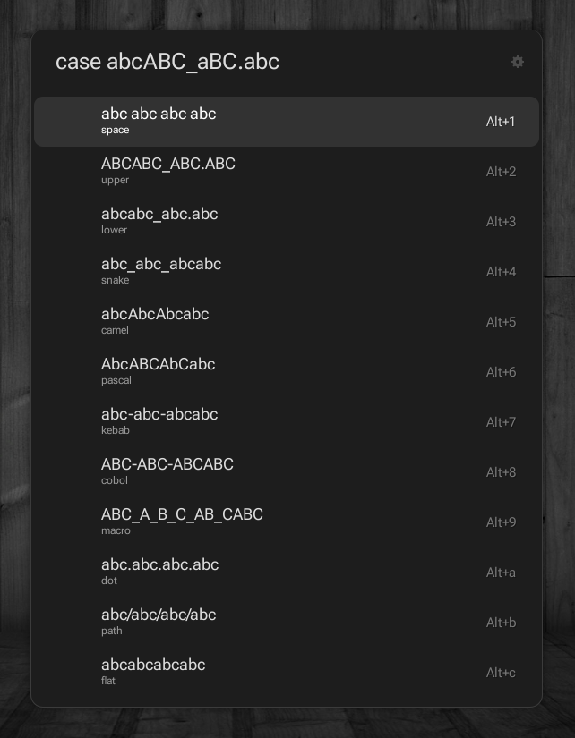

# Case Converter Ulauncher Extension

Quickly change the case (upper, lower, camel, pascal, snake, etc) by [case-converter](https://pypi.org/project/case-converter/)

```bash
  pip install case-converter
```

## Screenshot



### Converters configuration

  You can simply modify case convertors in `cases.py` file

## Install

Via `Add extension` option in ulauncher preferences

or by source

``` bash
git clone https://github.com/d-enk/ulauncher-case-converter.git \
~/.local/share/ulauncher/extensions/com.github.d-enk.ulauncher-case-converter
```
